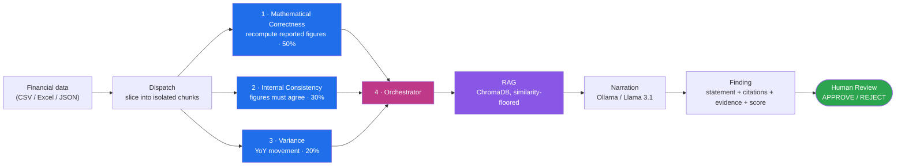

# Financial Statement Review Agent

**AI that reviews financial statements like an analyst who refuses to guess.**

Built for the NPN AI Ignite Hackathon. Four agents review real company financials: three rule-based specialists that each do exactly one job, and an orchestrator that grounds what they find in retrieved evidence and writes the analyst note — or plainly says *"insufficient evidence"* instead of inventing a cause. Every finding cites the exact figures and the line of the source file it came from, and lands in a human-in-the-loop queue as `PENDING` until a reviewer approves or rejects it.


-1f6feb)

---

## The problem

A human reviewer checking a company's financials has to do three things at once: verify the arithmetic, check the figures agree with each other, and notice what changed and by how much. LLMs are untrustworthy at all three — they recompute numbers wrong and invent plausible-sounding causes with total confidence. This project gives each job to a separate rule-based agent, and lets the LLM do only the one thing it's actually good at: writing up a result it isn't allowed to change.

> **Four agents. Each does one job. Reliable, not clever.**

Nothing here lets an LLM touch a number. Nothing here lets an LLM cite a source it didn't actually retrieve. And no agent can emit a finding without the source figures attached — that's a schema constraint, not a convention.

## How it works

The uploaded file is sliced into **isolated chunks**, and each specialist receives only the fields its own job needs. An agent cannot reach for data outside its remit, because that data is not present on the object it was handed.



| Agent | Its one job | Weight | Can it hallucinate? |
|---|---|---|---|
| **1 · Mathematical correctness** | Recomputes each reported figure from its own definitional formula and compares — *is this number computed right?* | 50% | No. It's math, and no LLM is involved. |
| **2 · Internal consistency** | Checks separately reported figures for contradictions — *do these numbers agree with each other?* | 30% | No. Fixed comparison rules. |
| **3 · Variance** | Measures year-over-year movement against graded materiality thresholds — *what changed, and does it matter?* | 20% | No. Pure arithmetic. |
| **4 · Orchestrator** | Routes chunks to the three, ranks findings, retrieves evidence, writes the analyst note, computes the weighted score | — | It's the only LLM step, and it can only write into a narration field. Refuses outright when no evidence was retrieved; falls back to a deterministic evidence-only summary when the LLM is unreachable. |
| **Human** | Approves or rejects each finding | — | The only step allowed to have the final word. |

**Honest scoring.** A rule whose inputs the source doesn't carry is reported as *skipped, with the reason stated* — never silently counted as a pass. The assigned dataset carries no total assets, total debt or COGS, so 5 of the 7 correctness rules cannot run against it, and the scorecard says so out loud. The weighted score renormalizes over the agents that could actually run, so missing columns lower coverage rather than faking a clean bill of health.

## Every finding traces to source data

The mentor's requirement — *not "revenue is high", but the exact line and figure* — is enforced by the schema. `AgentFinding.citations` requires at least one `SourceCitation`, and a statement with no digits in it is rejected at construction. A vague finding is not something the reviewer has to catch; it cannot be built.

```
ROE (AIG FY2018, row 58) = 0.1797%
Net Income (AIG FY2018, row 58) = $-6.0M
Share Holder Equity (AIG FY2018, row 58) = $57,309.0M
```

> ROE is reported as 0.1797% while the company reported a net loss of 6.0 on a positive shareholder equity of 57,309.0. A profitability ratio cannot have the opposite sign to net income when its denominator is positive, so one of these two reported figures is wrong.

That is a real break in the assigned dataset, found by agent 2, cited to the column and line it came from.

## See it work

```bash
curl -X POST http://localhost:8000/api/agent/review \
  -H "Content-Type: application/json" \
  -d '{"company": "AIG", "year": 2018, "max_findings": 2}'
```

```json
{
  "company": "AIG",
  "year": 2018,
  "findings": [
    {
      "title": "ROE reported 0.1797 vs recomputed -0.0105 (FY2018)",
      "severity": "HIGH",
      "source_agent": "mathematical_correctness",
      "check_code": "ROE_MISMATCH",
      "weight": 0.5,
      "fact": { "expected": -0.01047, "actual": 0.1797, "difference": 0.19017 },
      "citations": [
        { "rendered": "ROE (AIG FY2018, row 58) = 0.1797%" },
        { "rendered": "Net Income (AIG FY2018, row 58) = $-6.0M" },
        { "rendered": "Share Holder Equity (AIG FY2018, row 58) = $57,309.0M" }
      ],
      "grounded": true,
      "confidence": 0.68,
      "review_status": "PENDING"
    },
    {
      "title": "ROE sign contradicts net income (FY2018)",
      "severity": "HIGH",
      "source_agent": "internal_consistency",
      "check_code": "ROE_SIGN_CONTRADICTS_NET_INCOME",
      "weight": 0.3
    }
  ],
  "scorecard": {
    "weighted_score": 0.6,
    "agents": [
      { "agent": "mathematical_correctness", "weight": 0.5, "checks_run": 2, "checks_passed": 1, "checks_skipped": 5, "score": 0.5 },
      { "agent": "internal_consistency",     "weight": 0.3, "checks_run": 6, "checks_passed": 5, "checks_skipped": 1, "score": 0.8333 },
      { "agent": "variance",                 "weight": 0.2, "checks_run": 6, "checks_passed": 3, "checks_skipped": 0, "score": 0.5 }
    ]
  }
}
```

Real output, from the real dataset, right now. Two different agents independently caught the same bad row from two different angles. Every figure is cited to its source column and line; nothing was invented; nothing is final until a human clicks approve.

## Repository layout

```
├── backend/                        Python 3.13 + FastAPI
│   ├── app/
│   │   ├── main.py                     FastAPI entrypoint — wires every router below
│   │   ├── core/                       settings, SQLite persistence, repository layer
│   │   ├── api/routes/                 ingest · statements · analysis · agent · health
│   │   ├── schemas/                    FinancialStatement (rich) + FinancialRecord (flat, RAG-facing)
│   │   ├── documents/                  CSV/Excel ingestion — flat + Kaggle-format auto-detection
│   │   ├── engine/                     shared deterministic library — validation · ratios · variance
│   │   ├── rag/                        snippet synthesis · ChromaDB · grounded retrieval
│   │   ├── agents/                     THE FOUR AGENTS
│   │   │   ├── contracts.py                shared contract — citations required, weights, scoring
│   │   │   ├── dispatch.py                 slices data into per-agent isolated chunks
│   │   │   ├── correctness.py              agent 1 — mathematical correctness   (50%)
│   │   │   ├── consistency.py              agent 2 — internal consistency       (30%)
│   │   │   ├── variance_agent.py           agent 3 — year-over-year variance    (20%)
│   │   │   └── orchestrator.py             agent 4 — routing · RAG · narration · scoring
│   │   └── agent/                      shared services — Ollama client · prompts · finding store
│   ├── tests/                          engine, each agent in isolation, RAG, and full API integration
│   ├── data/                           the real dataset (financial_statements.csv)
│   └── requirements.txt
└── frontend/                       React 19 + Vite + TypeScript + Tailwind CSS 4  (Day 5 — in progress)
```

## Quickstart

**Backend**

```bash
cd backend
python -m venv .venv
.venv/Scripts/python -m pip install -r requirements-dev.txt   # Windows
# .venv/bin/pip install -r requirements-dev.txt                # macOS/Linux
cp .env.example .env
.venv/Scripts/python -m uvicorn app.main:app --reload --port 8000
```

```bash
# build the RAG index once, then explore
curl -X POST http://localhost:8000/api/analysis/index
curl "http://localhost:8000/api/analysis/flags?threshold_pct=30"
```

Run the suite:

```bash
cd backend && .venv/Scripts/python -m pytest    # 155 passed
```

**Frontend**

```bash
cd frontend
npm install
npm run dev                                     # http://localhost:5173
```

`/api` is proxied to the backend on port 8000 in dev. Different backend port? `VITE_API_PROXY=http://localhost:PORT npm run dev`.

**LLM (optional)** — the agent works with zero configuration, falling back to a deterministic evidence-only explanation. To turn on real narrative generation, run [Ollama](https://ollama.com) locally and set in `.env`:

```
LLM_PROVIDER=ollama
LLM_MODEL=llama3.1
```

## API reference

| Method & path | What it does |
|---|---|
| `POST /api/ingest/csv` \| `/excel` \| `/statement` | Ingest financial statements — auto-detects the Kaggle dataset format |
| `GET /api/statements` | List stored statements |
| `POST /api/analysis/validate` | Balance-sheet + accounting identity checks, no storage |
| `GET /api/analysis/flags` | Deterministic YoY variance flags, no LLM |
| `POST /api/analysis/index` | Build/rebuild the RAG vector index |
| `GET /api/analysis/findings` | Flags paired with retrieved evidence |
| `POST /api/agent/review` | Full four-agent review: dispatch → 3 rule-based agents → RAG → grounded finding + weighted scorecard |
| `GET /api/agent/findings` | List generated findings (filter by company/year/status) |
| `POST /api/agent/review/{id}` | Human approve/reject a finding |

## The dataset

[Kaggle: Financial Statements of Major Companies (2009–2023)](https://www.kaggle.com/datasets/rish59/financial-statements-of-major-companies2009-2023) — 161 real rows across 12 companies (`AAPL`, `AIG`, `AMZN`, `BCS`, `GOOG`, `INTC`, `MCD`, `MSFT`, `NVDA`, `PCG`, `PYPL`, `SHLDQ`), 2009–2023. It's purely tabular — no narrative filing text — so RAG's evidence corpus is synthesized directly from the source rows (one summary snippet per company-year, one comparison snippet per consecutive pair) rather than retrieved from prose. Every number in every snippet traces straight back to the CSV. See [`backend/app/rag/snippets.py`](backend/app/rag/snippets.py).

## Design principles

- **One job per agent.** Three specialists, each with a single remit and an isolated view of the data. Each is independently testable from a hand-built chunk — no CSV, no vector store, no other agent.
- **Deterministic first.** All three specialists are pure Python with fixed thresholds. No LLM appears anywhere in them.
- **Cited or it doesn't exist.** A finding requires at least one source citation — field, source column, value, and line in the uploaded file. Enforced by the schema, not by review.
- **Skipped is not passed.** A rule whose inputs are missing is reported as skipped with a stated reason. Silently scoring it clean would let a partially-checked statement read as a fully-checked one.
- **Grounded or silent.** Every interpretation traces to retrieved evidence with a similarity score. Below the floor, the system says so instead of guessing — and the deterministic finding still stands on its own.
- **Human in the loop.** Every finding starts `PENDING`. Figures, severity, citations and score are all fixed before any prompt is built; narration goes into a separate field that cannot alter them.
- **Fail safe, not silent.** No LLM configured, or unreachable? The orchestrator falls back to a deterministic, evidence-only summary instead of crashing or inventing an answer.

## Status

| Day | Focus | Status |
|---|---|---|
| 1 | Architecture + data | ✅ Done |
| 2 | Financial engine | ✅ Done |
| 3 | RAG | ✅ Done |
| 4 | Agent | ✅ Done |
| — | **Four-agent refactor** (mentor feedback) | ✅ Done |
| 5 | Frontend | 🚧 In progress |
| 6 | Integration + evaluation | ⬜ Planned |
| 7 | Demo + presentation | ⬜ Planned |

155/155 backend tests passing. The full pipeline — ingest → dispatch → three rule-based agents → retrieve → explain → review — runs end-to-end against the real dataset today.

**Known limitation, stated rather than hidden:** the assigned dataset reports no total assets, total liabilities, total debt or COGS, so only 2 of the 7 mathematical-correctness rules (Net Profit Margin and ROE recomputation) can run against it. The other 5 — including Assets = Liabilities + Equity — are implemented and reported as skipped with their reason, and will run unchanged against any source that carries those columns.
